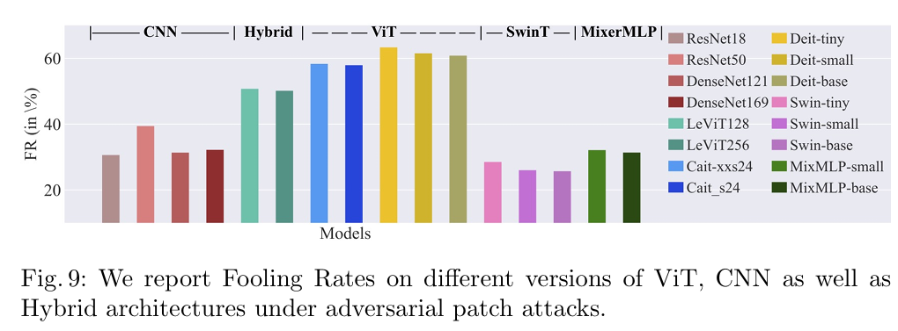

Based on the research [Unlabeled Data Improves Adversarial Robustness](https://arxiv.org/pdf/1905.13736) and [Are Vision Transformers Robust to Patch Perturbations?](https://arxiv.org/pdf/2111.10659), we wondering if it's possible to use the robust model Swin Transformer to instruct the training of other CNN to become robust to adverial attack too, by semi-supervised training?

